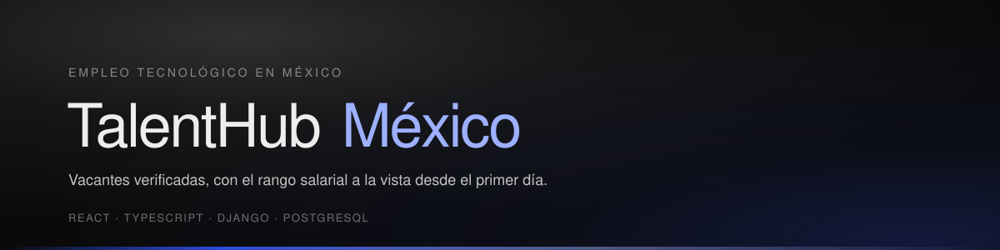

<div align="center">



<br>

**Bolsa de trabajo para el sector de TI en México.**
Las empresas publican vacantes, los aspirantes se postulan con un CV gestionado
por la plataforma, y cada vacante pasa por revisión humana antes de hacerse pública.

<br>

[](https://react.dev)
[](https://www.typescriptlang.org)
[](https://tailwindcss.com)
[](https://www.djangoproject.com)
[](https://www.django-rest-framework.org)
[](https://www.postgresql.org)
[](https://supabase.com)
[](https://azure.microsoft.com)

<br>

**[Sistema de diseño](DESIGN.md)** &nbsp;·&nbsp;
**[API](#api)** &nbsp;·&nbsp;
**[Correrlo en local](#correrlo-en-local)** &nbsp;·&nbsp;
**[Read in English](README.en.md)**

</div>

<br>

---


## Qué problema resuelve

Tres cosas que en la mayoría de los portales de empleo funcionan mal, y que
aquí condicionaron el modelo de datos en lugar de resolverse en la interfaz:

**Las ofertas fantasma.** Ninguna vacante se publica sola. Un validador la
aprueba o la rechaza antes de que exista para el público, y el historial de
esas decisiones queda registrado.

**El rango salarial escondido.** El salario mínimo y máximo son campos
obligatorios de la vacante, no una nota opcional al final de la descripción.
Si no hay rango, no hay publicación.

**La cosecha de datos de contacto.** El teléfono y el correo de un aspirante
no viajan en la respuesta de la API hasta que la empresa marca su postulación
como *en revisión*. No es que el cliente los oculte: no están ahí.

---

## Tres roles, tres tableros

| Rol | Qué puede hacer |
| --- | --- |
| **Aspirante** | Armar su perfil, subir CV, postularse y seguir cada postulación por Pendiente → En revisión → Aceptado / Rechazado |
| **Empresa** | Publicar, editar, pausar y reabrir vacantes; revisar postulaciones, descargar CVs y contratar un plan que amplía el alcance de una vacante |
| **Validador** | Aprobar o rechazar cada vacante antes de publicarse, suspender cuentas abusivas y mantener el catálogo de tecnologías que acepta la plataforma |

Los permisos se verifican por vista en el backend, incluido el rol, de manera
que un token válido de un rol no alcanza los endpoints de otro.

---

## Sistema de diseño

La interfaz no usa una librería de componentes. Corre sobre un sistema propio
documentado en **[DESIGN.md](DESIGN.md)**, donde cada decisión está registrada
con la medición que la respalda.

Las reglas que lo definen:

- **Claro por defecto, oscuro de acento.** El contenido vive en claro; el
  oscuro queda para hero, cierre, nav y las pantallas de sesión, siempre a
  filo y nunca en degradado.
- **Un solo color de interacción.** Azul ultramar `#3355ff` marca lo que se
  puede tocar, y nada más. Los colores de estado nunca visten un control
  clicable, así que nadie tiene que preguntarse qué color significa
  presionable.
- **El color marca resolución, no actividad.** Solo hay dos estados con color
  —teal para lo resuelto a favor, rojo para lo resuelto en contra— y lo que
  está en curso lleva tinta plena. El ámbar quedó fuera porque a 19° de matiz
  del rojo es indistinguible con daltonismo rojo-verde, y aquí significaban
  lo contrario.
- **Sin sombras de elevación.** La profundidad se construye con translucidez,
  hairlines y contraste de superficie.
- **Todo control es una píldora de 9999px.** Es la silueta que sostiene el
  carácter del sistema una vez que la paleta dejó de hacerlo.

### La paleta

| | Token | Valor | Uso |
| --- | --- | --- | --- |
|  | `accent` | `#3355ff` | Lo único que marca "esto se puede tocar" |
|  | `accent-on-dark` | `#9db0ff` | El mismo acento, sobre banda oscura |
|  | `ok` | `#0f766e` | Resuelto a favor: aceptada, publicada |
|  | `danger` | `#dc2626` | Resuelto en contra: rechazada, error |
|  | `ink` | `#161616` | Texto principal · 18.1:1 sobre blanco |
|  | `night` | `#0a0a0a` | Bandas oscuras |

Cada par de contraste está verificado contra WCAG AA, incluidos los textos que
caen sobre paneles translúcidos, donde el fondo efectivo cambia según el punto
de la página en que se pinten.

> **12 componentes compartidos** en `frontend/src/components/ui`
> y **13 páginas** construidas sobre ellos.

---

## Stack

| Capa | Tecnologías |
| --- | --- |
| **Frontend** | React 19, TypeScript, Tailwind CSS 3.4, react-router-dom 7, framer-motion, lucide-react, sileo |
| **Backend** | Django 6, Django REST Framework 3.16, autenticación por token, SDK de PayPal, Anymail |
| **Datos** | PostgreSQL alojado en Supabase; SQLite para desarrollo local |
| **Infraestructura** | Vercel (frontend), Render (backend), Azure para documentación y recursos del proyecto |

## Estructura

```
talenthub-mexico/
├── config/              Ajustes de Django, URLs raíz y cabeceras de seguridad
├── empleos/             App principal: modelos, vistas, serializadores, permisos
├── frontend/
│   └── src/
│       ├── components/
│       │   ├── ui/      Capa de componentes del sistema de diseño
│       │   ├── navbar   Nav flotante con lógica de roles
│       │   └── footer   Cierre del sitio
│       ├── pages/       Las 13 vistas de la aplicación
│       ├── lib/         Curvas de animación, utilidades, datos del responsable
│       └── services/    Cliente de API
├── media/               CVs y fotos de perfil subidos
├── DESIGN.md            Sistema de diseño
└── design-refs/         Especificaciones de las que se sintetizó
```

---

## API

Base: `/api/`. Autenticación por token en la cabecera `Authorization`.

<details>
<summary><b>Recursos REST</b> (ViewSets con CRUD completo)</summary>

| Endpoint | Descripción |
| --- | --- |
| `vacantes/` | Vacantes publicadas |
| `empresas/` | Perfiles de empresa |
| `aplicaciones/` | Postulaciones |
| `planes/` | Planes de publicación |
| `suscripciones/` | Suscripciones activas |
| `notificaciones/` | Notificaciones del usuario |

</details>

<details>
<summary><b>Cuenta y sesión</b></summary>

| Endpoint | Método | Descripción |
| --- | --- | --- |
| `register/` | POST | Alta de cuenta |
| `login/` | POST | Devuelve token, id, usuario y rol |
| `user-info/` | GET | Datos de la cuenta autenticada |
| `perfil/aspirante/` | GET · POST | Perfil profesional y archivos |
| `recuperar-password/` | POST | Envía el enlace de recuperación |
| `confirmar-password/` | POST | Confirma la nueva contraseña |

</details>

<details>
<summary><b>Validación</b> (solo rol validador)</summary>

| Endpoint | Método | Descripción |
| --- | --- | --- |
| `vacantes/pendientes/` | GET | Cola de revisión |
| `vacantes/validar/<pk>/` | POST | Aprobar o rechazar |
| `validador/metricas/` | GET | Métricas de la plataforma |
| `validador/usuarios/` | GET | Auditoría de cuentas |
| `validador/usuarios/<pk>/suspender/` | POST | Suspender o reactivar |
| `validador/vacantes/historial/` | GET | Historial de resoluciones |
| `validador/tecnologias/` | GET · POST | Catálogo oficial |
| `validador/tecnologias/<pk>/` | DELETE | Quitar del catálogo |

</details>

<details>
<summary><b>Pagos</b></summary>

| Endpoint | Método | Descripción |
| --- | --- | --- |
| `pago/crear/` | POST | Crea la orden en PayPal |
| `pago/capturar/` | POST | Confirma el cobro y activa el plan |
| `suscripcion/actual/` | GET | Suscripción vigente |
| `suscripcion/cancelar/` | POST | Vuelve al plan gratuito |

</details>

---

## Seguridad

Tres medidas que moldearon el modelo de datos en vez de agregarse encima:

**El contacto va enmascarado por defecto.** Los serializadores de DRF
devuelven el teléfono y el correo de un aspirante solo cuando la empresa ya
avanzó esa postulación. El campo no viene en la respuesta; no es que el
cliente lo tape.

**Los archivos se validan en el servidor.** Tope de 5 MB, solo `.pdf` para CVs
y solo `.jpg` / `.png` para fotos. La revisión corre en el backend, así que se
sostiene aunque la petición no venga de la aplicación web.

**Los permisos se verifican por vista**, incluido el rol, de manera que un
token válido de un rol no alcanza los endpoints de otro.

A eso se suman cabeceras de seguridad y una CSP restrictiva en producción, con
una lista blanca explícita para los dominios de PayPal.

---

## Correrlo en local

```bash
git clone https://github.com/yeu-dev/talenthub-mexico.git
cd talenthub-mexico
```

### Backend

Crea un `.env` en la raíz del repositorio. Las credenciales de producción no
están en el repo — pídeselas a quien lo mantiene si las necesitas.

```env
DB_NAME=nombre_de_la_bd
DB_USER=usuario_de_la_bd
DB_PASSWORD=contrasena_de_la_bd
DB_HOST=host_de_la_bd.supabase.com
DB_PORT=6543

EMAIL_HOST_USER=usuario_smtp
EMAIL_HOST_PASSWORD=contrasena_smtp

SECRET_KEY=clave_secreta_de_django
DJANGO_DEBUG=True
USE_SQLITE=True
```

`USE_SQLITE=True` se salta PostgreSQL y corre contra un archivo local, así que
las primeras cuatro variables solo hacen falta cuando quieres apuntar a la
base real.

```bash
python -m venv venv
source venv/bin/activate        # Windows: venv\Scripts\activate
pip install -r requirements.txt
python manage.py migrate
python manage.py createsuperuser
python manage.py runserver
```

### Frontend

```bash
cd frontend
npm install
npm start
```

El frontend espera la API en `http://localhost:8000/api`. Para apuntar a otra,
crea `frontend/.env` con `REACT_APP_API_URL`.

---

## Flujo de trabajo

Rama de trabajo → PR a `develop` → PR de `develop` a `main`. Los mensajes de
commit siguen el formato convencional (`feat(scope):`, `refactor(scope):`,
`docs:`, `chore:`) y explican el porqué, no el qué: el diff ya dice qué
cambió.

---

## Ecosistema

| Proyecto | Estado | Stack |
| --- | --- | --- |
| **TalentHub Web** |  | React · TypeScript · Django · PostgreSQL |
| **TalentHub Móvil** |  | React Native · Expo · NativeWind · Supabase |

La versión móvil corre sobre la misma infraestructura de datos y suma
navegación nativa y autenticación biométrica.

---

## Equipo

| | Rol | Responsabilidad |
| --- | --- | --- |
| **Yeudiel González** | Lead Fullstack Developer & Software Architect | Arquitectura de software, backend en Django, integración de pagos e interfaz en React/TypeScript |
| **Luis Díaz** | Cloud Infrastructure & Technical Documentation | Wiki del proyecto, despliegues y gestión de recursos en Azure |
| **Jaziel Arana** | Product Manager & QA Analyst | Flujo de usuario, testing de componentes y validación de las reglas de negocio |

<br>

<div align="center">

**Hecho en Puebla, México**

<sub>Proyecto académico · Universidad Tecnológica de Puebla</sub>

</div>
